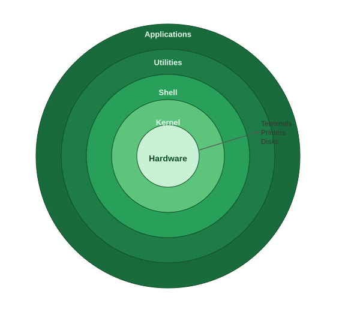
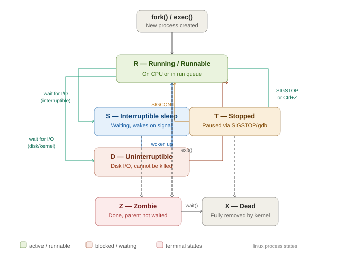

**1. The core components of Linux (kernel, user space, init/systemd)**

The core components of linux are hardware kernel, Shell and application.
- Hardware: The physical component where OS is installed. The kernel talks with hardware
- Kernel: it is the heart of linux, all the interactions happens via kernel. If a user runs a command, it comes to kernel who have the Code for each command which gets executed and user get an answer for same. The code for each command is saved in /bin folder
- Shell is a interpreter who is a middle person between the user and kernel 
- Application: It is software application which is designed to run Linux commands 

**2. How processes are created and managed**

Whenever a user runs a command, the system creates a process for it and associate a PID, this process is managed by kernel. 

**3. What systemd does and why it matters**
SystemD, initializes the process, it is the first process when system boots, i.e PID 1, where **d** stands for daemon, which is a silent runner in the backend without user intervention and performs task automatically.

**4. Explain process states (running, sleeping, zombie, etc.)**

•	Running: The process is actively running and each process takes up CPU, Memory to execute the code and logic

•	Sleeping: the process is waiting for an event or process. Here it goes under two stages: 

1. interruptable sleep:  when a process waits for user input, the process goes into the Interruptible sleeping state (s) interruptible sleep state.
2. uninterruptable sleep: Process pauses while waiting for a critical event/resource (usually I/O) and cannot be killed by kill -9

•	Stopped: The process is being stopped SIGTSTP 

•	Zombie: The process has completed execution, but it’s entry in the process table still exists, waiting for parent to read its exit status.

•	Terminated / Dead (X): The process that has finished execution, freed off all the resources, and no longer on the process table. SIGCHILD

## Linux Process States

| State | Code | Meaning |
|-------|------|---------|
| Running | `R` | On CPU or waiting in run queue |
| Interruptible sleep | `S` | Waiting, can be woken by signal |
| Uninterruptible sleep | `D` | Blocked on disk I/O, kill -9 won't work |
| Stopped | `T` | Paused via SIGSTOP or Ctrl+Z |
| Zombie | `Z` | Finished but parent hasn't called wait() |
| Dead | `X` | Fully removed by kernel |

**5. List 5 commands you would use daily**

- top/htop: to look into the process running on your machine

•	df: to check the disk space.

•	Chmod: to change the permissions of the files.

•	Mkdir: to create a directory.

•	Systemctl to make sure the service is enable/disabled/stopped or running.
